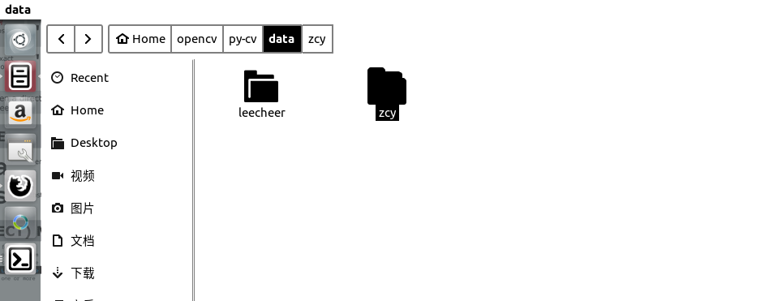
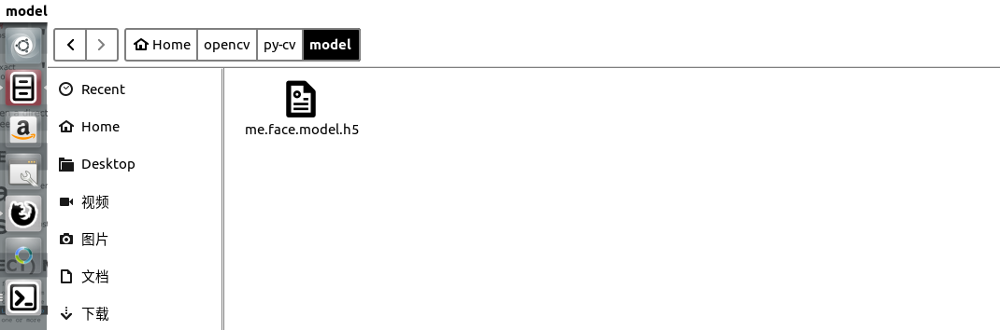
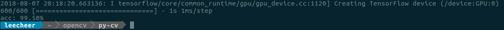

Two persons recognition use keras, train model and deploy.
==========================================================
Two folders.

One model.

Accuracy.

Test Window.

Run it!
-------
* File1: `python 1realtimev.py 0 `#opencv open the webcam and show it in the window, Para 0 is camera's id.
* File2: `python 2facezone.py 0 `#Recognize the face zone.
* File3: `python 3dataface.py 0 1000 /path/to/your/data/folder/ `# 0 1000 is the number of picture we cut from webcam, /path/to/you/data/folder/ is the directory we store our photoes.
* File4: `python load_face_dataset.py `#load the dataset to memoery.
* File5: `python 5facetrainusekears.py `#save the model to model directory.
* File6: `python evaluate.py `# Use the model we saved, and output the accuracy.
* File7: `python 7recognition.py  0 `# The final product.
